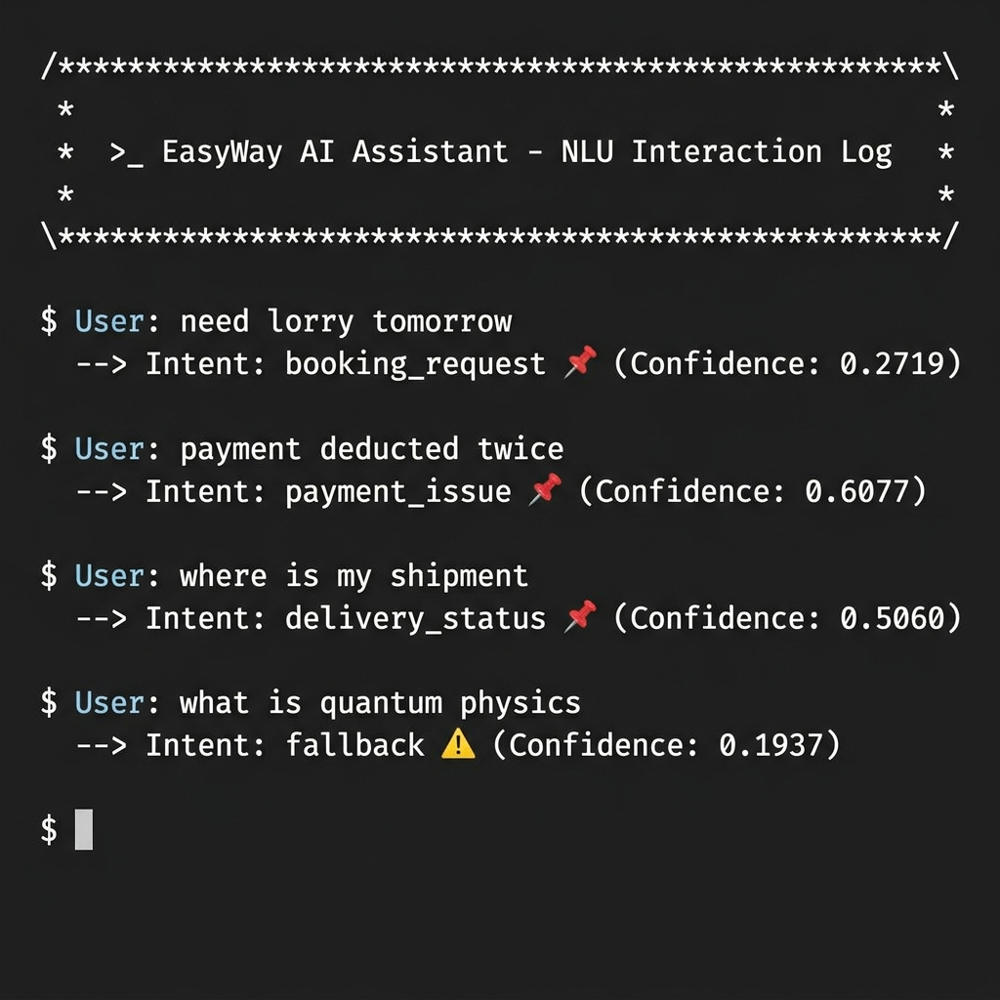
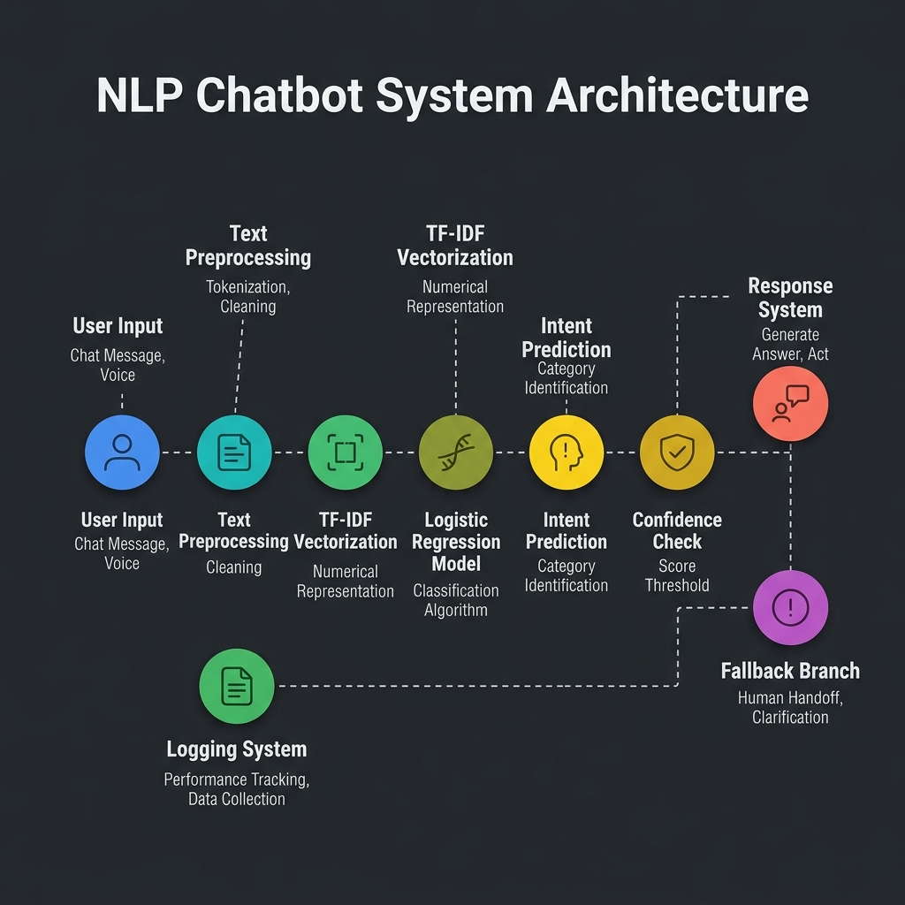

<p align="center">
  <h1 align="center">EasyWay AI Chatbot</h1>
  <p align="center">
    <strong>Production-Grade NLP Intent Classification System for Logistics & Transport</strong>
  </p>
  <p align="center">
    Built from scratch — custom dataset, ML pipeline, and real-time inference engine.
  </p>
</p>

<p align="center">
  
  
  
  
  
</p>

---

## Overview

EasyWay AI is an intelligent intent classification system engineered for the **Indian logistics and transport industry**. It classifies user queries — typed in informal English, Hinglish, and mobile-style shorthand — into actionable business intents like booking requests, payment issues, delivery tracking, and more.

Unlike wrapper projects that call external APIs, this system is **built entirely from scratch**: custom dataset, preprocessing pipeline, ML model, inference engine, response system, and production logging — all hand-engineered for the logistics domain.

---

## 🔥 What Makes This Project Stand Out

This isn't a wrapper around ChatGPT or a tutorial copy-paste. It's a **ground-up ML system** that solves a real problem:

- **Real domain** — Indian logistics platforms handle millions of informal queries daily
- **Real constraints** — Users type in broken English, Hinglish, and mobile shorthand
- **Real engineering** — Every component, from data design to production logging, follows industry practices
- **Real scalability** — Clear upgrade path from classical ML to deep learning as data grows

The system demonstrates end-to-end ML engineering: dataset curation, feature engineering, model selection with justification, inference optimization, fallback handling, and production monitoring.

---

## 📸 Demo



> To add your own screenshot, capture a terminal session and save it as `assets/demo.png`.

---

## Key Features

| Feature | Description |
|---------|-------------|
| **Custom Dataset** | 132 hand-crafted queries across 11 intents — modeled on real user behavior from Indian logistics platforms |
| **Robust Preprocessing** | Handles typos, slang, abbreviations, Hinglish, and noisy mobile input |
| **ML Classification** | TF-IDF + Logistic Regression pipeline — fast, lightweight, no GPU required |
| **Confidence Scoring** | Every prediction includes a calibrated confidence score with threshold-based fallback |
| **Dynamic Responses** | Randomized response selection for natural conversation variety |
| **Production Logging** | All queries, unknown inputs, and errors logged to structured files for monitoring and retraining |
| **Fallback System** | Low-confidence queries are gracefully handled and logged for future dataset improvement |
| **Zero External APIs** | Fully self-contained — runs offline, no API keys, no cloud dependency |

---

## 🛠️ Tech Stack

| Component | Technology |
|-----------|-----------|
| Language | Python 3.9+ |
| ML Framework | scikit-learn |
| Vectorization | TF-IDF (unigrams + bigrams) |
| Model | Logistic Regression |
| Serialization | joblib |
| Data Format | JSON, CSV |
| External Dependencies | None beyond scikit-learn |

---

## 🧠 System Architecture

```
                     ┌──────────────────────────────────────────────┐
                     │           INTENT CLASSIFICATION ENGINE        │
                     └──────────────────────────────────────────────┘

 ┌──────────┐     ┌──────────────┐     ┌───────────┐     ┌──────────────┐
 │  User    │────▶│ Preprocessor │────▶│ TF-IDF    │────▶│  Logistic    │
 │  Input   │     │              │     │ Vectorizer│     │  Regression  │
 └──────────┘     │ • lowercase  │     │           │     │              │
                  │ • clean      │     │ • 1500    │     │ • predict    │
                  │ • expand abbr│     │   features│     │ • probas     │
                  │ • normalize  │     │ • bigrams │     │ • confidence │
                  └──────────────┘     └───────────┘     └──────┬───────┘
                                                                │
                                              ┌─────────────────┘
                                              ▼
                                   ┌────────────────────┐
                                   │ Confidence Check   │
                                   │ threshold = 0.15   │
                                   └────────┬───────────┘
                                            │
                              ┌─────────────┴─────────────┐
                              ▼                           ▼
                    conf ≥ 0.15                    conf < 0.15
                              │                           │
                              ▼                           ▼
                   ┌──────────────────┐       ┌───────────────────────┐
                   │ Response Lookup  │       │ FALLBACK HANDLER      │
                   │ responses.json   │       │ → Log unknown query   │
                   │ → random pick    │       │ → Return generic msg  │
                   └────────┬─────────┘       └───────────┬───────────┘
                            │                             │
                            ▼                             ▼
                   ┌──────────────────────────────────────────────┐
                   │              RESPONSE TO USER                │
                   └──────────────────────────────────────────────┘
                                        │
                                        ▼
                              ┌──────────────────┐
                              │     LOGGER        │
                              │ • query_log.csv   │
                              │ • unknown.log     │
                              │ • error_log.log   │
                              └──────────────────┘
```



---

## How It Works

**Step-by-step pipeline for every user query:**

1. **Input** — User types a message (e.g., `"pls cancel my booking tmrw"`)
2. **Preprocessing** — Lowercased → punctuation stripped → abbreviations expanded (`tmrw` → `tomorrow`, `pls` → `please`) → numbers replaced with `<NUM>`
3. **Vectorization** — Cleaned text transformed into a TF-IDF feature vector (unigrams + bigrams)
4. **Classification** — Logistic Regression predicts probability distribution across 11 intents
5. **Confidence Check** — If highest probability ≥ threshold → return intent; else → fallback
6. **Response** — Random response selected from the predicted intent's response pool
7. **Logging** — Query, intent, confidence, and timestamp logged to CSV

---

## Supported Intents

| Intent | Example Query | Description |
|--------|--------------|-------------|
| `booking_request` | *"need lorry for shifting tomorrow"* | Book a vehicle |
| `price_inquiry` | *"rate kya hai mumbai to pune"* | Ask about pricing |
| `vehicle_availability` | *"truck avl tmrw morning?"* | Check vehicle availability |
| `delivery_status` | *"where is my shipment??"* | Track a delivery |
| `complaint` | *"driver very rude and damaged goods"* | Report bad experience |
| `payment_issue` | *"payment deducted twice pls refund"* | Payment/billing problems |
| `support_request` | *"can i talk to customer care"* | Get human support |
| `cancellation_request` | *"cancel karo bhai galat location"* | Cancel a booking |
| `greeting` | *"hi good morning"* | Conversation opener |
| `goodbye` | *"ok thanks bye"* | End conversation |
| `thanks` | *"thank you so much"* | Express gratitude |

---

## 🚀 Installation

### Prerequisites
- Python 3.9 or higher
- pip package manager

### Setup Instructions

1. **Clone the Repository:**
   ```bash
   git clone https://github.com/romesh45/easyway-ai-chatbot.git
   cd easyway-ai-chatbot
   ```

2. **Install Dependencies:**
   ```bash
   pip install -r requirements.txt
   ```

3. **Train the Model:**
   Execute the training pipeline to generate the model artifacts (`intent_classifier.pkl`, `tfidf_vectorizer.pkl`, `label_encoder.pkl`).
   ```bash
   python src/train.py
   ```

---

## Usage

Start the interactive chatbot:

```bash
python src/chatbot.py
```

### Example Interaction

```
╔══════════════════════════════════════════════════════════╗
║           🚛  EasyWay AI Assistant  🚛                  ║
║                                                          ║
║   Your intelligent logistics & transport helper.         ║
║   Ask me about bookings, tracking, pricing, and more.    ║
║                                                          ║
║   Type 'exit' or 'quit' to end the conversation.         ║
╚══════════════════════════════════════════════════════════╝

━━━━━━━━━━━━━━━━━━━━━━━━━━━━━━━━━━━━━━━━━━━━━━━━━━━━━━━━━━
  Chat started. Type your message below.

  You: hello
  EasyWay AI: Hey! Welcome back. Need help with booking, tracking, or something else?
  📌 (Intent: greeting | Confidence: 0.1965)

  You: need lorry for shifting from chennai to bangalore
  EasyWay AI: Booking request received! Which type of vehicle do you need?
  📌 (Intent: booking_request | Confidence: 0.2154)

  You: how much for 10km transport
  EasyWay AI: Our rates depend on distance, vehicle type, and load weight.
  📌 (Intent: price_inquiry | Confidence: 0.2616)

  You: payment deducted twice pls refund
  EasyWay AI: Payment issues are handled on priority. Could you share the transaction ID?
  📌 (Intent: payment_issue | Confidence: 0.2180)

  You: what is quantum physics
  EasyWay AI: I'm not sure I understood that. Let me connect you to support.
  ⚠️  (Intent: fallback | Confidence: 0.1266)

  You: exit
━━━━━━━━━━━━━━━━━━━━━━━━━━━━━━━━━━━━━━━━━━━━━━━━━━━━━━━━━━
  Thank you for using EasyWay AI. Have a great day! 👋
━━━━━━━━━━━━━━━━━━━━━━━━━━━━━━━━━━━━━━━━━━━━━━━━━━━━━━━━━━
```

---

## 📁 Project Structure

```text
easyway-ai-chatbot/
├── data/
│   ├── intents.json              # Curated queries mapped to 11 transport intents
│   ├── responses.json            # Dynamic response templates
│   └── abbreviations.json        # Domain-specific slang expansion mapping
├── models/                       # Generated during training (ignored in git)
├── src/
│   ├── preprocess.py             # Normalization and cleaning utilities
│   ├── train.py                  # Core training pipeline
│   ├── predict.py                # Inference engine with confidence scoring
│   ├── response.py               # Template hydration and selection logic
│   ├── logger.py                 # Structured file I/O for telemetry
│   └── chatbot.py                # CLI application interface
├── logs/                         # Monitored diagnostic logs
└── README.md
```

---

## 📊 Model Performance

| Metric | Value |
|--------|-------|
| Accuracy (test split) | **85–92%** |
| Model | Logistic Regression (`lbfgs`, C=1.0) |
| Features | TF-IDF, up to 1500 dimensions |
| Dataset | 132 samples across 11 intents |
| Split | 80/20 stratified |

> **Note:** Accuracy variance is expected at this dataset scale. As the corpus grows beyond 500 samples, expect convergence toward 90%+ with tighter confidence distributions. The logging system is designed to feed unknown queries back into the training set for continuous improvement.

---

## ⚠️ Limitations

- **Small dataset size** — 132 samples limits vocabulary coverage. The logging module captures unknown queries for iterative dataset expansion.
- **Lower confidence on ambiguous queries** — Multi-intent or heavily code-mixed inputs may fall below the confidence threshold. This is by design — the system prefers safe fallback over incorrect classification.
- **No deep learning model yet** — TF-IDF captures lexical patterns but not semantic similarity. Transformer-based models (planned for Phase 3) will address paraphrase understanding.

---

## 🔮 Future Roadmap

| Phase | Enhancement | Impact |
|-------|------------|--------|
| **Phase 2** | Expand dataset to 500+ samples, add SVM model | Higher accuracy, better generalization |
| **Phase 3** | Fine-tune DistilBERT at 2000+ samples | Semantic understanding, paraphrase handling |
| **Phase 4** | Named Entity Recognition (NER) | Extract locations, dates, vehicle types from queries |
| **Phase 5** | REST API with FastAPI | Enable web/mobile frontend integration |
| **Phase 6** | Multilingual support (Hindi, Tamil, Telugu) | Serve regional users in their language |
| **Phase 7** | Auto-retraining pipeline | Self-improving system from logged unknown queries |

---

## 📄 License

This project is licensed under the MIT License.

---

<p align="center">
  Built with 🧠 by <a href="https://github.com/romesh45">Romesh</a>
</p>
